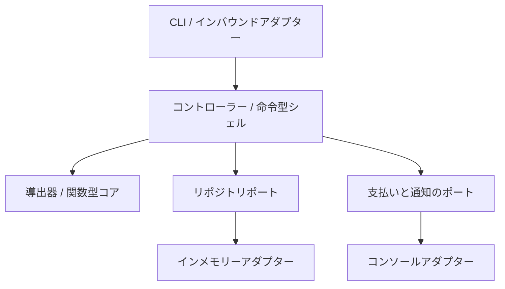

<!-- i18n: language-switcher -->
[English](README.md) | [日本語](README.ja.md)

# F# ラボ

F#を「構文暗記」で終わらせず、Scott Wlaschinの考え方をインプット、実装、説明、別ドメインへの再適用まで繰り返して身につける学習環境です。

主軸は次の3つです。

1. [F# for Fun and Profit](https://fsharpforfunandprofit.com/)で関数型の考え方を学ぶ
2. [Domain Modeling Made Functional](https://pragprog.com/titles/swdddf/domain-modeling-made-functional/)と[公開サンプル](https://github.com/swlaschin/DomainModelingMadeFunctional)で型駆動のDDDを学ぶ
3. [Railway-Oriented-Programming-Example](https://github.com/swlaschin/Railway-Oriented-Programming-Example)でエラーを型とパイプラインに組み込む

補助として、[DmmfWorkshop](https://github.com/swlaschin/DmmfWorkshop)と[Functional Domain Driven Design: Simplified](https://antman-does-software.com/functional-domain-driven-design-simplified)のFunctional Core / Imperative Shellも扱います。

## 5分で開始

前提はNixとVS Codeだけです。

```bash
git clone https://github.com/hjosugi/fsharp-lab.git
cd fsharp-lab
nix develop
code .
```

VS Codeが推奨拡張を表示したらIonideをインストールします。その後、統合ターミナルで次を実行します。

```bash
just check
just run
```

最初の小さなスクリプトは次で実行できます。

```bash
just basics
```

## Input → Outputループ

各モジュールは、以下を全部終えて初めて完了です。

| 段階 | 必須成果物 |
|---|---|
| Input | 指定記事・章を読み、自分の言葉で5行に要約する |
| Recall | 資料を閉じ、主要な型とパイプラインを紙またはMarkdownに再現する |
| Implement | `labs/`の課題をF#で実装する |
| Verify | 例、エッジケース、失敗ケースのテストを追加する |
| Explain | 2分で「なぜこの型にしたか」を説明する |
| Transfer | SubscriptionではなくParkingドメインで同じ考えを再実装する |

進捗管理は[16週間ロードマップ](docs/00-learning-path.md)を使います。

## 完成サンプル

`src/`にはSubscriptionアップグレードを題材にした、最小の実行可能なFunctional DDDがあります。



- Entity: F#のレコードとシングルケースのユニオン
- 不変条件: 小さな純関数
- 導出器: 入力から識別型の結果を返す純関数
- コントローラー: リポジトリや外部I/Oを調整する`Async`関数
- アダプター: インメモリーリポジトリとコンソール効果

## ディレクトリ構成

```text
labs/                         FSIで動かす段階的な演習
labs/parking/                 別ドメインへ転用する最終課題
src/FSharpLab.Domain/         型、不変条件、導出器
src/FSharpLab.Application/    ポート、コントローラー、ワークフロー
src/FSharpLab.Infrastructure/ リポジトリとエフェクトアダプター
src/FSharpLab.Cli/            コンポジションルートと実行例
tests/FSharpLab.Tests/         外部テストパッケージ不要の高速テストランナー
docs/                         読書順、理解基準、設計メモ
```

## コマンド一覧

| コマンド | 目的 |
|---|---|
| `just basics` | 最初のF#スクリプトを実行 |
| `just build` | 全プロジェクトをビルド |
| `just test` | ドメインとコントローラーのテストを実行 |
| `just run` | 完成サンプルを実行 |
| `just parking-solution` | Parking課題の解答例を実行 |
| `just check` | ビルドとテストをまとめて実行 |

## 技術基準

- .NET 10 LTS / `net10.0`
- F# SDKスタイルのプロジェクト
- Nix flake (`nixpkgs`のunstableの`dotnet-sdk_10`)
- VS Code + Ionide
- Node.js 24（Fable/Elmish発展トラック）
- NuGet依存なしのコアサンプル
- Linux、macOS、NixOS、WSL上のNixを対象

Scott Wlaschinのコアを終えた後は、[Fable/Elmish発展トラック](docs/08-fable-elmish-track.md)でZaid Ajajの教材へ進みます。

まず[モジュール0](docs/00-learning-path.md)を開始してください。