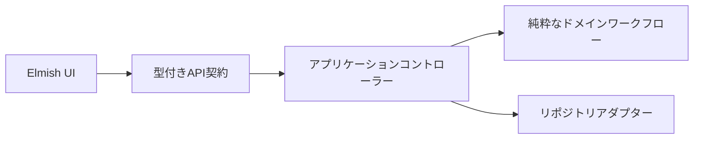

<!-- i18n: language-switcher -->
[English](08-fable-elmish-track.md) | [日本語](08-fable-elmish-track.ja.md)

# Fable / Elmish発展トラック

Scott Wlaschinで学んだ型、関数、ワークフローを、Zaid Ajajの教材でWebアプリケーションに接続します。

## Input 1: The Elmish Book

[The Elmish Book](https://github.com/Zaid-Ajaj/the-elmish-book)は、F#をJavaScriptにコンパイルするFableと、The Elm Architectureを基礎から扱います。

重点:

- `Model`: UIが必要とする状態の完全な表現
- `Msg`: UIで起こり得るイベントの有限集合
- `update`: `Msg -> Model -> Model * Cmd<Msg>`
- `view`: ModelからUIを導出する関数
- ローディング、成功、失敗をDUで表す

出力:

1. `labs/03-elmish-update.fsx`を資料なしで再実装する
2. Booleanフラグを複数持つモデルとDUモデルを比較する
3. 不可能なUI状態を列挙し、型で排除する
4. Parking検索画面のModel/Msg/updateを書く

## Input 2: Fable.Remoting

[Fable.Remoting](https://github.com/Zaid-Ajaj/Fable.Remoting)は、クライアントとサーバー間のプロトコルを`Async`を返す関数レコードとして表現します。

```fsharp
type ParkingApi = {
    search: SearchQuery -> Async<Result<Parking list, SearchError>>
    requestPublication: ParkingId -> Async<Result<unit, PublicationError>>
}
```

重点:

- 共有型は便利だが、バウンデッドコンテキストのドメインモデル全部を共有しない
- API契約と内部ドメイン型を区別する
- ネットワーク／システム障害と型付きビジネス結果を区別する
- バージョニング、認証、冪等性は型の共有だけでは解決しない

出力:

1. API契約を型シグネチャから設計する
2. サーバー実装とフェイククライアント実装を作る
3. `Result`をElmishの`Msg`へ変換する
4. ネットワーク障害を`RemoteData` DUへ変換する

## 最終出力

Parkingのバウンデッドコンテキストを次のエンドツーエンドのフローとして説明・実装します。



完了条件は、UI、プロトコル、アプリケーション、ドメインの各型を混ぜず、境界のマッピングを説明できることです。