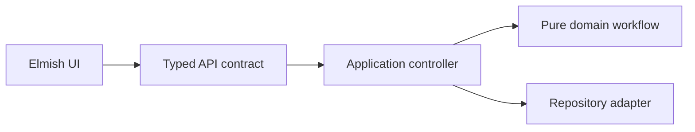

# Fable / Elmish発展track

Scott Wlaschinで学んだtypes、functions、workflowを、Zaid Ajajの教材でWeb applicationへ接続します。

## Input 1: The Elmish Book

[The Elmish Book](https://github.com/Zaid-Ajaj/the-elmish-book)は、F#をJavaScriptへcompileするFableと、The Elm Architectureを基礎から扱います。

重点:

- `Model`: UIが必要とする状態の完全な表現
- `Msg`: UIで起こり得るeventの有限集合
- `update`: `Msg -> Model -> Model * Cmd<Msg>`
- `view`: ModelからUIを導出するfunction
- Loading、success、failureをDUで表す

Output:

1. `labs/03-elmish-update.fsx`を資料なしで再実装する
2. Boolean flagを複数持つmodelとDU modelを比較する
3. impossible UI stateを列挙し、型で消す
4. Parking search画面のModel/Msg/updateを書く

## Input 2: Fable.Remoting

[Fable.Remoting](https://github.com/Zaid-Ajaj/Fable.Remoting)は、client/server間のprotocolを`Async`を返すfunction recordとして表現します。

```fsharp
type ParkingApi = {
    search: SearchQuery -> Async<Result<Parking list, SearchError>>
    requestPublication: ParkingId -> Async<Result<unit, PublicationError>>
}
```

重点:

- Shared typeは便利だが、bounded contextのdomain model全部を共有しない
- API contractと内部domain typeを区別する
- Network/system failureとtyped business outcomeを区別する
- Versioning、authorization、idempotencyは型共有だけでは解決しない

Output:

1. API contractをtype signatureから設計する
2. Server implementationとfake client implementationを作る
3. `Result`をElmishの`Msg`へ変換する
4. Network failureを`RemoteData` DUへ変換する

## 最終output

Parking bounded contextを次のend-to-end flowとして説明・実装します。



完了条件は、UI、protocol、application、domainの各型を混ぜず、境界mappingを説明できることです。

