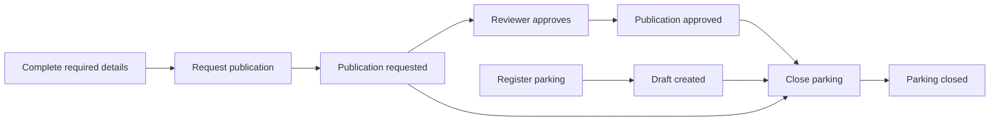
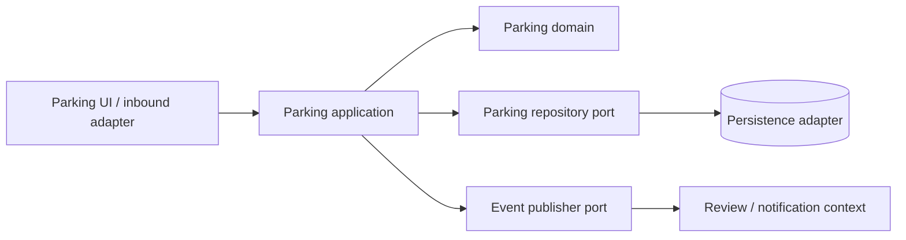

# Parking bounded context capstone

このcapstoneはSubscription sampleの構造を別domainへ移し、単なる型名の置換ではなく、Parking固有の状態遷移と境界を設計した成果物です。実装は次にあります。

- `src/FSharpLab.Domain/Parking`: constrained types、state、pure workflow
- `src/FSharpLab.Application/Parking`: command、ports、effect orchestration
- `src/FSharpLab.Infrastructure/Parking`: in-memory repository/event adapter
- `tests/FSharpLab.Tests/ParkingTests.fs`: domain/application contract tests

## Ubiquitous Language

| Term | Meaning |
|---|---|
| Draft | 登録されたが、公開必須項目が揃っていない可能性がある駐車場 |
| Publication request | 完成したDraftをreview queueへ送る操作 |
| Pending approval | 必須項目の検証を通過し、Reviewerの判断を待つ状態 |
| Published | 利用者に表示できる状態。申請時刻と公開時刻を保持する |
| Closed | 営業を終了した終端状態。再公開できない |
| Reviewer | Pending approvalを承認するapplication actor |
| Opening hours | 開始時刻が終了時刻より前という制約を持つ値 |

## Event Storming



主要なpolicyは次の通りです。

- `Request publication`はAddress、HourlyRate、OpeningHoursが全部ある場合だけ成功する。
- `Approve publication`はPending approvalにだけ適用できる。
- `Close parking`はDraft、Pending approval、Publishedのどこからでも実行できる。
- Closedは終端状態であり、同じcommandの再実行も明示的な`AlreadyClosed`になる。

## Context map



Parking contextはReview/notification contextの内部modelを知りません。境界を越えるのは`ParkingEvent`だけです。本番ではdomain eventを同じtransactionのoutboxへ書き、非同期publisherがintegration eventへ変換します。

## Workflow signatures

Pure core:

```fsharp
requestPublication : DateTimeOffset -> ParkingState -> PublicationRequestDecision
approvePublication : DateTimeOffset -> ParkingState -> ApprovalDecision
close              : DateTimeOffset -> ParkingState -> ClosureDecision
```

Imperative shell:

```fsharp
type ParkingRepository = {
    GetById : ParkingId -> Async<ParkingState option>
    Save : ParkingState -> Async<unit>
}

type RequestPublication = ParkingId -> Async<ParkingCommandOutcome>
```

型を見るだけで、domain decisionはI/Oを行わず、Controllerだけがload/save/publish/clockを扱うと分かります。

## Effect matrix

| Outcome | Save | Publish event |
|---|---:|---:|
| Accepted / Approved / Closed | 1 | 1 |
| Not found | 0 | 0 |
| Missing fields | 0 | 0 |
| Invalid current state | 0 | 0 |

testsはhappy path、各union case、0円境界、営業時間の逆転、履歴保持、effect非実行、end-to-end遷移を含みます。

## Subscription sampleとの比較

共通点は、domain decisionをpure functionにし、expected failureをexceptionではなくDUで返し、Controllerが必要なeffectだけを実行することです。

相違点は、Subscription upgradeが一回のdecisionで既存aggregateを更新するのに対し、ParkingはDraft → Pending → Published → Closedという長寿命state machineであることです。そのためParkingでは状態ごとのrecordを分け、各状態に存在可能なdataを型で限定しました。`PublishedAt option`と複数booleanを一つのrecordに置く設計より、illegal stateを作りにくくなります。

## Production trade-offs

- In-memory adapterは学習用で、process終了時に消える。本番はoptimistic versionを持つrepositoryが必要。
- `Save`と`Publish`は現在別effect。本番はtransactional outboxでatomicにする。
- 同じcommandのretryにはidempotency keyが必要。現在のtyped rejectionは重複を安全に見える化するが、network retryのexactly-onceを保証しない。
- 複数contextにまたがる承認・通知はdistributed transactionにせず、outbox + retry + dead-letterで最終的整合性を取る。
- Authorizationはdomain invariantではなくinbound/application policyとしてcommand実行前に確認する。

## 説明用outline

### 2分版

1. boolean flagsではなく4状態のDUでillegal stateを消した。
2. constrained typesがblank name、negative rate、逆転した営業時間を境界で拒否する。
3. workflowはclockやDBを引数/portに追い出したpure coreである。
4. Controllerはdecisionが成功した時だけsaveとevent publishを行う。
5. testsはoutcomeだけでなく「effectが呼ばれない」ことも確認する。

### 10分deep dive

1. Event StormingとUbiquitous Language
2. constrained typesとstate-specific records
3. pure workflowのsignatureと全decision case
4. repository/event/clock ports
5. effect matrixとcontract tests
6. outbox、optimistic concurrency、idempotency、authorizationのproduction gap

実際の録音と自己評価は、実装を見ずにこのoutlineを説明した後で行います。
